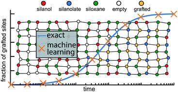

# Grafting metal complexes to amorphous supports
This repository contains code to perform calculations done in "Grafting metal complexes onto amorphous supports: from elementary steps to catalyst site populations via kernel regression". Please refer to reference 1 for the theory and background of the project.

# Usage
All the calculations and and plots generated for reference 1 can be accessed by running il_pedagogical/Grafting_compact.ipynb. The file generates an amorphous 2D lattice, calculates grafting barriers, plots the evolving population of unreacted surface sites, and uses a machine learning model to learn grafting barriers as a function of local environments.

# References
[1] Khan, S. A.; Vandervelden, C.; Scott, S. L.; Peters, B. Grafting metal complexes onto amorphous supports: from elementary steps to catalyst site populations via kernel regression. React. Chem. Eng. 2020, 5, 66-76.